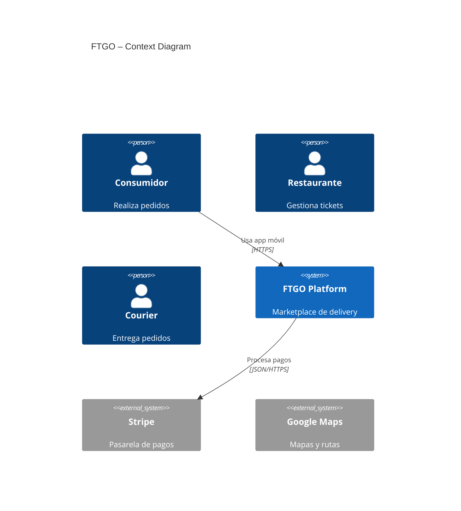
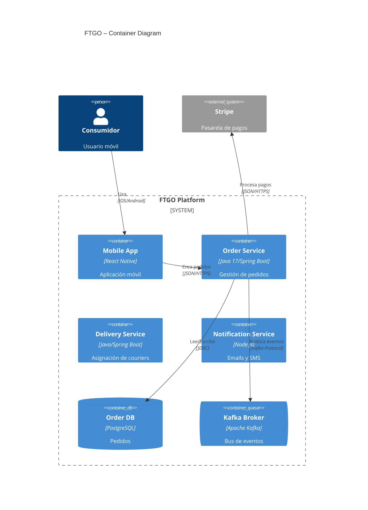

# PR-C4-FTGO-001 — Prompt Mejorado Diagramas C4 FTGO

## Metadatos

| Campo              | Valor                    |
| ------------------ | ------------------------ |
| ID                 | PR-C4-FTGO-001           |
| Artefacto destino  | Diagramas C4 Nivel 1 y 2 |
| Modelo recomendado | Sonnet / Opus            |
| Temperatura        | 0.2                      |
| Versión            | v1.0-improved            |

---

# Role

Eres un arquitecto de software experto en el modelo C4 de Simon Brown y en sintaxis Mermaid para diagramas `C4Context` y `C4Container`. Conoces profundamente el caso FTGO del libro *Microservices Patterns* de Chris Richardson y tienes experiencia documentando sistemas distribuidos y migraciones desde monolitos usando Strangler Fig.

---

# Task

Produce 2 diagramas Mermaid del caso FTGO:

1. `c4_context.mmd`

   * Diagrama de contexto (Nivel 1)
   * FTGO como un único sistema
   * Personas y sistemas externos

2. `c4_container.mmd`

   * Diagrama de contenedores (Nivel 2)
   * Microservicios, bases de datos, broker y aplicaciones cliente
   * Tecnologías y protocolos explícitos

Los diagramas deben ser coherentes con:

* el PRD,
* los ADRs,
* el brief FTGO,
* y la estrategia de migración incremental.

---

# Context

## Documentos fuente

* `docs/PRD.md`
* `docs/adr/0001-*.md`
* `docs/adr/0002-*.md`
* `/materiales/Brief_Caso_FTGO.md`

---

## Elementos obligatorios para Nivel 1

### Personas

* Consumidor
* Restaurante
* Courier
* Empleado FTGO

### Sistema principal

* FTGO Platform

### Sistemas externos

* Stripe
* Google Maps
* SendGrid
* Twilio
* Monolito Legacy FTGO

Origen:

* [Brief §A.1]
* [Brief §A.2]
* [Brief §A.4]

---

## Restricciones arquitectónicas relevantes

* Migración incremental con Strangler Fig.
* Escalabilidad horizontal independiente.
* Tolerancia a fallos externos.
* Trazabilidad distribuida.
* Consistencia fuerte en pedidos.
* Java/Spring Boot preferido para core services.

---

## Convención de trazabilidad

Usar referencias explícitas:

* `[Brief §A.X]`
* `[ADR-XXXX]`
* `[PRD NFR-XX]`
* `[Richardson Cap.X]`

---

# Reasoning

Sigue estos pasos en orden:

1. Construye el Nivel 1 usando únicamente:

   * personas,
   * FTGO como sistema único,
   * sistemas externos.
2. NO incluir microservicios internos en Nivel 1.
3. Construye el Nivel 2 usando:

   * servicios,
   * bases de datos,
   * aplicaciones cliente,
   * brokers,
   * integraciones externas.
4. Usa esta regla de separación:

   * Nivel 1 → actores externos y sistema FTGO como caja negra.
   * Nivel 2 → estructura interna técnica de FTGO.
5. En Nivel 2 cada relación debe incluir:

   * tecnología,
   * protocolo,
   * tipo de comunicación.
6. Si los ADRs usan async communication:

   * incluir broker/event bus.
7. Si los ADRs usan database-per-service:

   * incluir bases separadas.
8. Verificar sintaxis Mermaid válida antes de finalizar.
9. NO incluir razonamiento interno en el output final.

---

# Stop condition

Detente únicamente cuando:

* existan los 2 diagramas Mermaid completos,
* Nivel 1 tenga:

  * mínimo 1 System,
  * mínimo 1 Person,
  * mínimo 2 System_Ext,
* Nivel 2 tenga:

  * mínimo 5 contenedores,
  * relaciones con protocolo explícito,
  * tecnologías declaradas,
* ambos diagramas usen sintaxis Mermaid C4 válida,
* no existan errores estructurales de Mermaid,
* el Nivel 1 no contenga detalles internos.

No continúes produciendo contenido más allá de estas condiciones.

---

# Output

Formato: dos bloques Mermaid separados.

---

## Nivel 1 — Context Diagram

Usar obligatoriamente:

---

## Nivel 2 — Container Diagram

Usar obligatoriamente:

---

# Invariants

* Ambos diagramas deben usar sintaxis Mermaid válida.
* Nivel 1 no debe contener detalles internos.
* Nivel 2 debe tener mínimo 5 contenedores.
* Todas las relaciones del Nivel 2 deben incluir tecnología/protocolo.
* Los diagramas deben ser coherentes con ADRs y PRD.
* Debe existir referencia al monolito legacy durante migración.

---

# Verification

Antes de finalizar verificar:

* Mermaid renderiza correctamente.
* Nivel 1 contiene únicamente contexto externo.
* Nivel 2 contiene arquitectura interna.
* Existen protocolos explícitos en relaciones.
* Las tecnologías son coherentes con ADRs.
* Kafka/event bus aparece si existe async communication.
* Las bases están separadas si existe database-per-service.
* El monolito legacy aparece durante Strangler Fig.

---

# Failure modes

## E_MISSING_INPUTS

Faltan PRD o ADRs → abortar.

---

## E_INVALID_MERMAID

La sintaxis Mermaid no renderiza → reintentar.

---

## E_LEVEL_MIXED

Nivel 1 contiene detalles internos → corregir.

---

## E_NO_TECH_PROTOCOL

Existen relaciones sin tecnología/protocolo → reintentar.

---

## E_INCONSISTENT_ADR

El diagrama contradice decisiones arquitectónicas → corregir.

---

# Changelog

| Cambio                                               | Motivo                               |
| ---------------------------------------------------- | ------------------------------------ |
| Se agregaron personas y sistemas externos explícitos | Evitar omisiones del brief           |
| Se añadió regla formal Nivel 1 vs Nivel 2            | Reducir mezcla incorrecta de niveles |
| Se agregó referencia Mermaid completa                | Mejorar validez sintáctica           |
| Se añadió sección Verification                       | Reducir errores de renderizado       |
| Se fortaleció trazabilidad arquitectónica            | Cumplir rúbrica del laboratorio      |
| Se agregaron restricciones derivadas de ADRs         | Mantener consistencia técnica        |
| Se añadió referencia al monolito legacy              | Reflejar Strangler Fig               |
